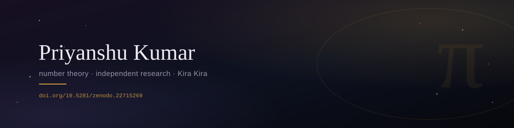

### priyanshu kumar

number theory, mostly — self-studying toward JEE Advanced the rest of the time.
Currently deep in a 1914 Ramanujan paper, making sure every step actually
holds up instead of just looking plausible.

**[Reconstructing and Extending Ramanujan's 1914 Series for 1/π →](https://doi.org/10.5281/zenodo.22715269)**
Full proof of his Equation 3, plus five new series for 1/π found in an
unfinished notebook table — verified to 40+ decimal digits.

Also make animated math videos as **Kira Kira**, because half of learning
this stuff is wanting to explain it to someone else afterward.

---

